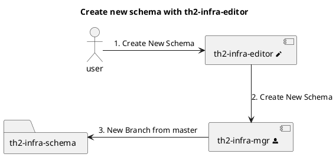
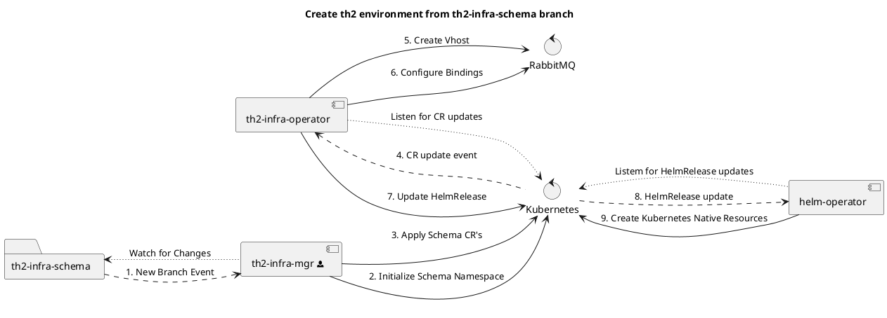
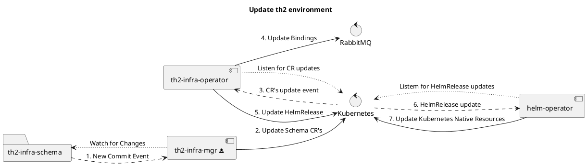
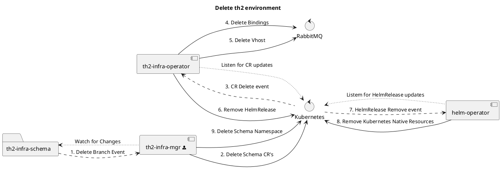

# th2-infra components

The th2-infra components are an important part of the th2 infrastructure. 
While the infra-schema describes a th2 environment configured for a particular testing use case, the other infra components provide control over such environments. 

<!--more-->

Infra components are an intermediate layer between the user and the Kubernetes cluster. 
This layer changes the th2 environments in accordance with the state of the **infra-schema**.


## Components

There are 5 Infra components:

1. **[th2-infra-schema](https://github.com/th2-net/th2-infra-schema-demo)** - a special repository that contains schema configurations, acting as a config files' storage that works via Git.
2. **[th2-infra-mgr](https://github.com/th2-net/th2-infra-mgr)** - component that watches for the changes in the repositories and deploys the changed components to Kubernetes. 
3. **[th2-infra-operator](https://github.com/th2-net/th2-infra-operator)** - an implementation of Kubernetes custom resource controller.
4. **[th2-infra-editor](https://github.com/th2-net/th2-infra-editor)** - a web GUI for schema control.
5. **infra-repo** - an abstract chart used by Helm operator (the element is not shown on the diagram below).

## Components interactions


### Edit infra-schema

You have 2 ways to edit your **infra-schema**:

1. Git-based - by committing the changes directly into your **infra-schema**.
2. GUI-based - by interacting with **infra-editor** (a special Graphical User Interface in th2).

### infra-editor and infra-mgr interaction


**infra-editor** gets information on current state of **infra-schema** from **infra-mgr**, displays it for the user using web GUI, and allows them to configure environment via sending changes to **infra-mgr**.

### Reading-editing infra-schema by infra-mgr

The **infra-mgr** monitors the state of the **infra-schema** repository and stores it in its cache.
Users can deploy their customized **infra-schemas** easily by using **infra-mgr**.
All a user has to do is pick one of four options provided in the infra-mgr config file. 
This file is present with each **infra-schema**.

Also, **infra-mgr** can change the **infra-schema** repository.

### infra-mgr and infra-operator interaction

Users can conveniently introduce changes to the cluster by editing <term term="Custom resource">Custom resources</term> of the **infra-schema**.
The **infra-mgr** monitors the infra-schema repository for the changes and rolls out updated schemas to Kubernetes. 
The **infra-operator** which monitors the cluster for changes to custom resources  configures the message/event routing in RabbitMQ as required.
It will also upload Helm releases for further configuration and deployment of th2 boxes in the cluster if requested.


## Data transformation

The table below provides the mapping between the elements of a th2 **infra-schema**  and corresponding entities of a deployed Kubernetes cluster. 

| **th2-infra-schema** repository                                                       | Kubernetes cluster                                                             |
|---------------------------------------------------------------------------------------|--------------------------------------------------------------------------------|
| Git branch                                                                            | th2 environment (Kubernetes namespace + Cassandra keyspace + RabbitMQ VHost)   |
| `Th2Box`, `Th2CoreBox`, `Th2Estore`, `Th2Mstore` <term term="Custom resource"></term> | Kubernetes <term term="ConfigMap"></term>, Kubernetes <term term="Pod"></term> |
| `Th2Link` <term term="Custom resource"></term>                                        | Bindings in RabbitMQ                                                           |
| `Th2Dictionary` <term term="Custom resource"></term>                                  | Kubernetes <term term="ConfigMap"></term> (saved in encoded format)            |

## Scenarios 

All the infra components are created to work together to transform the data representations provided by **infra-schema** into the actual implementation of the th2 environment.

The below scenarios outline typical ways to interact with infra components in th2.

<!-- Plantuml code is ciphered inside link -->
<!-- To see plantuml code, go to a link in browser and change '/png/' to '/uml/' in the path -->

1. Create new schema using **infra-editor**  
  



2. Create th2 environment from the **infra-schema** branch



3. Update th2 environment



4. Delete th2 environment



## Installation

**th2 infra components**  are deployed as a single Helm release:
 
```shell
helm repo add th2 https://th2-net.github.io
helm install -n service --version=<version> th2-infra th2/th2 -f configuration.yaml -f secrets.yaml
```

## Configuration

Configure the infra-components at initialization using their corresponding config files.

A short configuration and a full configuration are provided below.

### th2-infra configuration

Short configuration:

```yaml
infraMgr:
  git:
    repository: git@github.com:th2-net/th2-infra-demo-configuration.git

rabbitmq:
  prometheus:
    operator:
      enabled: false
  persistentVolume:
    enabled: true
    storageClass: local-storage
    size: 10Gi

cassandra:
  internal: false
  host: <cassandra-host>
```

<spoiler title="Full configuration">

All the provided values are default. 

```yaml
# Image repositories and credentials to create pull secrets
productRegistry:
  secret: th2-core
  name:
  username:
  password:

solutionRegistry:
  secret: th2-solution
  registry:
  username:
  password:

ingress:
  host:

externalRabbitMQHost:
  host: localhost

infraEditor:
  image:
    repository: ghcr.io/th2-net/th2-infra-editor
    tag: 1.0.65

infraRepo:
  image:
    repository: ghcr.io/th2-net/infra-repo
    tag: 0.6.0

infraOperator:
  prometheusConfiguration:
    enabled: true
  image:
    repository: ghcr.io/th2-net/th2-infra-operator
    tag: 3.2.8 
  config:
    chart:
      # external mirror
      # repository: https://th2-net.github.io
      repository: http://infra-repo:8080
      version: 0.6.0
      name: infra-operator-tpl
    namespacePrefixes:
      - "th2-"
    k8sUrl: "<kubernetes-external-entrypoint>"
    rabbitMQManagement:
      #      host: "rabbitmq-discovery.service.svc.cluster.local" - deprecated. host is taken from rabbitmq config
      port: "15672"
      username: "th2"
      password: "${RABBITMQ_PASS}"
      persistence: true
      schemaPermissions:
        configure: ""
        read: ".*"
        write: ".*"

infraMgr:
  prometheusConfiguration:
    enabled: true
  image:
    repository: ghcr.io/th2-net/th2-infra-mgr
    tag: 1.2.9
  git:
    secretName: infra-mgr
    privateKeyFileSecret: infra-mgr
    secretMountPath: /home/service/keys
    repository: git@github.com:th2-net/th2-demo-configuration.git
    repositoryLocalCache: /home/service/repository
    httpAuthUsername: "" #should be stored in secret th2-git-access-schemas
    httpAuthPassword: "" #should be stored in secret th2-git-access-schemas
  rabbitmq:
    vHostPrefix: th2-
    usernamePrefix: th2-user-
    secret: rabbitmq
    passwordLength: 24
  cassandra:
    keyspacePrefix: schema_
    secret: cassandra
  kubernetes:
    namespacePrefix: "th2-" # must be not more than 5 symbols
    ingress: ingress-rules
    configMaps:
      logging: logging-config-template
      rabbitmq: rabbit-mq-app-config
      rabbitmq-ext: rabbit-mq-external-app-config
      cassandra: cradle
      cassandra-ext: cradle-external
      prometheus: prometheus-app-config
    secrets:
      - th2-core
      - th2-solution
      - th2-proprietary

# If service not internal - ExternalName service will be created, credentials will be mapped to secrets / config maps
# otherwise service will be deployed as a chart dependency
rabbitmq:
  internal: true
  rabbitmqMemoryHighWatermark: 1024MB
  #it is not required if the service internal
  #  host: ""
  fullnameOverride: rabbitmq
  rabbitmqVhost: th2
  rabbitmqUsername: th2
  # will be generated if empty
  rabbitmqPassword: ""
  rabbitmqErlangCookie: ""
  rabbitmqExchange: th2-exchange
  replicaCount: 1
  podAntiAffinity: hard
  persistentVolume:
    enabled: true
    storageClass: local-storage
    size: 10Gi
  livenessProbe:
    exec:
      command:
        - /bin/bash
        - -ec
        - rabbitmq-diagnostics -q check_running
    initialDelaySeconds: 120
    timeoutSeconds: 20
    periodSeconds: 30
    failureThreshold: 6
    successThreshold: 1
  readinessProbe:
    exec:
      command:
        - /bin/bash
        - -ec
        - rabbitmq-diagnostics -q check_running
    initialDelaySeconds: 10
    timeoutSeconds: 20
    periodSeconds: 30
    failureThreshold: 3
    successThreshold: 1
  service:
    type: "NodePort"
    amqpNodePort: 32000
  rabbitmqPrometheusPlugin:
    enabled: true
  prometheus:
    exporter:
      enabled: false
    operator:
      enabled: true
      alerts:
        enabled: true
      serviceMonitor:
        selector:
          release: prometheus

# If service not internal - ExternalName service will be created, credentials will be mapped to secrets / config maps
# otherwise service will be deployed as a chart dependency
cassandra:
  internal: true
  #it is not required if the service internal
  #  host: ""
  fullnameOverride: cassandra
  cluster:
    datacenter: dc1
  dbUser:
    user: th2
    # will be generated if empty
    password: ""
  keyspace: cradle
  persistence:
    enabled: false
    storageClass: local-storage
    size: 50Gi
```
</spoiler>

### Credentials for service integration

```yaml
# reguired only for images from a private registry, will be attached as the first PullSecret to deployments
#productRegistry:
#  username: user
#  password: password
#  name: private-registry-1.example.com # core components registry

# reguired only for images from a private registry, will be attached as the second PullSecret to deployments
#solutionRegistry:
#  username: user
#  password: password
#  name: private-registry-2.example.com # components registry

# reguired only for images from a private registry, will be attached as the third PullSecret to deployments
#proprietaryRegistry:
#  username: user
#  password: password
#  name: private-registry-3.example.com # components registry

cassandra:
# set credentials for existing Cassandra cluster
  dbUser:
    user: <user-name>
    password: <password>

rabbitmq:
# set admin user credentials, it will be created during deployment
  rabbitmqUsername: th2
  rabbitmqPassword: rab-pass
  # must be random string
  rabbitmqErlangCookie: cookie
```
