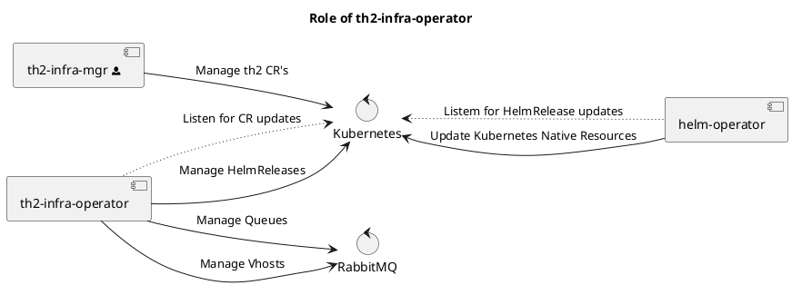

---
tree-title: infra-operator
weight: 15
repo_owner: th2-net
repo: th2-infra-operator
related:
  - name: "th2-net/th2-infra"
    icon: "mdi-github"
    href: "https://github.com/th2-net/th2-infra"
--- 

# th2-infra-operator

**infra-operator** (th2 infrastructure operator) is one of th2 infra components that works with the current state of th2 system. 
It is installed along with the th2 framework infrastructure.

Basically, **infra-operator** is an implementation of Kubernetes custom controller. 

It monitors <term term="Custom resource">custom resources</term> and ensures the synchronization between them and Helm releases in the Kubernetes cluster. 


## Functionality


Being the component that interacts with schema environment, **infra-operator** has the following objectives:

- It monitors Kubernetes events related to the th2 <term term="Custom resource">Custom resources</term> and generates or modifies the corresponding Helm Releases.
- Based on the config map `rabbit-mq-app-config` which is deployed by **infra-mgr**, it creates Vhost in RabbitMQ for every schema namespace.
- For each Vhost it creates a user in RabbitMQ and configures its permissions.
- Based on the pins described in the custom resources it declares queues in RabbitMQ.
- It binds the queues in RabbitMQ according to `Th2Link` resources.
- Generates RabbitMQ configs for each resource that needs it.
- Generates [gRPC](https://grpc.io/docs/) configs for each resource that needs it.

Mostly, **infra-operator** communicates with other infra components using Kubernetes as an intermediary. 
All the interconnections are displayed on the diagram below.



## Configuration

Settings for **infra-operator** should be defined in the `infraOperator` section of the values file. 
They will be applied during deployment of **infra** into the Kubernetes cluster. 

All possible parameters with the descriptions are provided below:

```yaml
# infra-operator.yml
# version 1.5.4
namespacePrefixes:
  - namespace-
  - prefixes-
# these prefixes are used to filter namespaces that infra-operator will manage as a schema
chart:
# this section includes information about git or helm repository as a source of helm charts
# you can specify either git or helm repository
  # git repository parameters 
  git: git@some.server.com:some/repository
  # git repository URL for helm charts used by Th2 Custom Resources
  
  ref: branch
  # branch for helm charts
  path: /path/to/charts
  # repository path for charts
  # helm repository parameters 
  repository: https://helm.server.com/some/repository
  # helm repository URL for helm charts used by Th2 Custom Resources
  name: components
  # the name of the Helm chart without an alias
  version: 3.2.0
  # the targeted Helm chart version
rabbitMQManagement:
  host: host
  # RabbitMQ host used for managing vHosts and users
  
  port: 8080
  # RabbitMQ port
  
  username: username
  # RabbitMQ management username
  
  password: password
  # password for management user
  
  persistence: true
  # determines if the RabbitMQ resources are persistent or not
  
  schemaPermissions:
  # this section describes what permissions schema RabbitMQ user will have on its own resources
  # see RabbitMQ documentation to find out how permissions are described
    configure: pattern
    # configuration permissions on resources
    
    read: pattern
    # read permission on resources
    
    write: pattern
    # write permission on resources
    
configMaps:
# this section contains names of the ConfigMaps that are mounted in the boxes
  rabbitMQ: rabbit-mq-config-map
  # RabbitMQ server connectivity ConfigMap
k8sUrl: kubernetes-address
# address for kubernetes cluster. 
# this will be used as host in gRPC config for boxes that are running in node network or externally
schemaSecrets:
# this section contains secret names that are mounted in the boxes
  rabbitMQ: rabbitmq
  # secret name to connect to RabbitMQ server
  cassandra: cassandra
  # secret name to connect to cassandra database
  
ingressHost: hostName
# host name that will be used inside ingress rules
```
<spoiler title="Example of infra-operator config in service.values.yaml">

```yaml
# service.values.yaml
# ...
infraOperator:
  image:
    repository: ghcr.io/th2-net/th2-infra-operator
    tag: 3.1.3
  config:
    namespacePrefixes: 
    - "th2-"
```

</spoiler>
