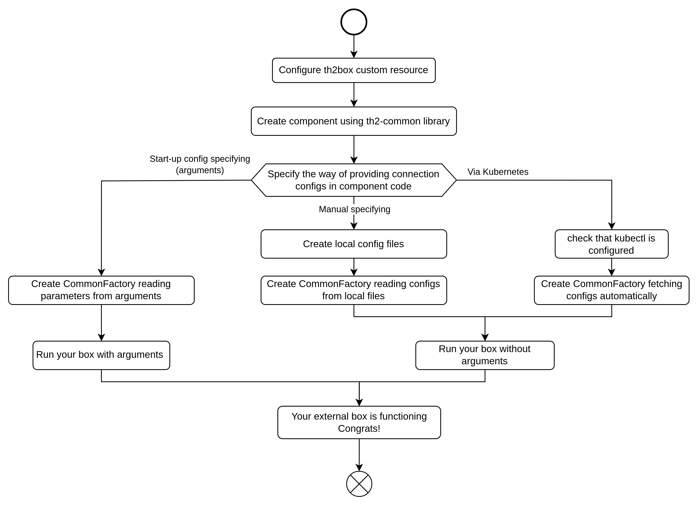

# How to run a box outside the cluster

th2 provides the capability to run external components as part of the th2 Kubernetes cluster. 
Typical use cases of the `externalBox` feature include:

- testing and debugging a new box
- running the scripts for specific tasks (including testing activities)
- running th2 components that are used on-demand


<!--more-->

## Prerequisites

1) A th2 cluster and a box with the `externalBox` option specified in its config.

2) Kubectl installed and connected to the Kubernetes cluster (not required if you are defining the config for the `externalBox` manually).

3) **common** library used in the external component’s code:

- Java / Kotlin – [th2-common-j](https://github.com/th2-net/th2-common-j)  version 3.9.1 and above.
- Python – [th2-common-py](https://github.com/th2-net/th2-common-py).

## Running external box

To run an external box in your th2 Kubernetes cluster, follow the steps as per the algorithm below.



## 1. Configure th2box custom resource

With `externalBox`, you can configure boxes that will run outside Kubernetes cluster. 
To do that, add the `externalBox` details into the `extended-settings` section of the component’s <term term="Custom resource">custom resource</term>.

First, add `externalBox.enabled: true` to the existing CR box. 
Then, provide the address for the RabbitMQ server using the `address` field. 
Finally, specify the internal mapping for the ports in the `endpoints` list by giving a `name` to the port and providing its number as a `targetPort` value.

<notice warning>

If an external box has a pin with the `subscribe` attribute and there is a box in Kubernetes that publishes on your pin (e.g. the **act** component has the `from_codec` pin receiving messages from the **codec** via RabbitMQ), then, upon closing your external application, the messages will be accumulated in the queue, which can overfill the cluster memory. 
To prevent that, configure the queue limit on your external box pins.

</notice>

The full list of `externalBox` parameters can be found in the example below:

`box_config.yaml`

```yaml

apiVersion: th2.exactpro.com/v1
kind: Th2Box
metadata:
  name: box_name
spec:
  image-name: some_image_name
  image-version: some_image_version
  type: th2-box-type
  custom-config:
      # Depends on specific th2 component
  pins:
      # Depends on specific th2 component
  extended-settings:
    externalBox: 
      enabled: true
      address: <e.g. IP>
      endpoints:
        - name: 'grpc'
          targetPort: 8080

```

## 2. Create a box with th2-common library

`th2-common` is a special library that implements an API for th2 components. 
It is available for two programming languages: Java/Kotlin – [th2-common-j](https://github.com/th2-net/th2-common-j)  and Python – [th2-common-py](https://github.com/th2-net/th2-common-py).

<notice note>

`th2-common` must be implemented in the module for running it as an *external box*.

</notice>

You can create your own module or download a ready-made one.
Examples of the repositories with `th2-common` implemented:
- Java/Kotlin – [th2-sim-template](https://github.com/th2-net/th2-sim-template/)
- Python – [th2-demo-script](https://github.com/th2-net/th2-demo-script/)

More details about `th2-common` can be found [here](../../fundamentals/th2-common/)

## 2.1. Provide connection configs for th2-common library

To link your *external box* with the boxes inside the th2 cluster, `th2-common` needs connection configs. 
There are three options to provide these configs – manually, using kubectl, or using arguments in a startup command.

### 2.1.1. Providing connection configs via kubectl

<notice note>

To provide configs using this method, you need to have kubectl installed on your machine.

</notice>

1) Get your [service account token](https://kubernetes.io/docs/reference/access-authn-authz/service-accounts-admin/) (you can find details in [Managing Service Accounts page](https://kubernetes.io/docs/reference/access-authn-authz/service-accounts-admin/)).

2) Configure Kubernetes context using kubectl (you can find detailed information in [Kubernetes documentation](https://kubernetes.io/docs/tasks/access-application-cluster/configure-access-multiple-clusters/)).

To specify the config details, use the following CLI commands:

```shell
kubectl config set-credentials <service-account-name> --token=<token>
kubectl config set-cluster <cluster-name> --server=https://5.6.7.8 --insecure-skip-tls-verify
kubectl config set-context <context-name> --cluster=<cluster-name> --namespace=<namespace> --user=<service-account-name>
```

Alternatively, you can provide the values by changing the `.kube/config.yaml` file manually:

```yaml

apiVersion: v1
 clusters:
 - cluster:
     insecure-skip-tls-verify: true
     server: https://5.6.7.8
   name: <cluster-name>
 contexts:
 - context:
     cluster: <cluster-name>
     namespace: <namespace>
     user: <service-account-name>
   name: <context-name>
 current-context: "<context-name>"
 kind: Config
 preferences: {}
 users:
 - name: <service-account-name>
   user:
     token: <token>

```

<spoiler title="Code examples">

Python example:

```python
factory = CommonFactory.create_from_kubernetes(
      namespace="th2-schema", 
      box_name="script-entry-point")
```

Java example:

```java
var factory = CommonFactory.createFromKubernetes(
      namespace, 
      boxName, 
      contextName)
```

</spoiler>  

More details about this option [here](../../fundamentals/th2-common/#option-2-access-config-files-from-the-kubernetes-cluster)

After completion of this step, [run your box without arguments](./#31-run-without-arguments).

### 2.1.2. Provide connection configs manually
`CommonFactory` is a class that contains a set of tools for creating connections between boxes in th2 cluster and module developed.
Essentially, it transfers the `.json` configuration files to the `CommonFactory` object:

- `grpc.json`
- `mq.json`
- `rabbit.json`

Configuration of these files varies depending on the components that are to be in interaction with your component.

[integrations](../../fundamentals/th2-common/#th2-common-integrations-configuration)

<spoiler title="Passing .json files to CommonFactory">

Python example:

```python
from th2_common.schema.factory.common_factory import CommonFactory

factory = CommonFactory(
    grpc_router_config_filepath="./configs/grpc.json",
    rabbit_mq_config_filepath="./configs/rabbitMQ.json",
    mq_router_config_filepath="./configs/mq.json")
```

Java example:

```java
import com.exactpro.th2.common.schema.factory.CommonFactory;

CommonFactory factory = CommonFactory.createFromArguments("--configs", "./configs");
```

</spoiler>

<spoiler title="The .json files">

Configuration examples can be found below. 
Documents for downloading and modifications [here](https://github.com/th2-net/th2-common-py/tree/e99d8df8e164f840daeb39eb66410a5022493c34/test/test_configuration/resources/json_configuration):

**gRPC.json file**

It contains the host and ports of components for interaction (**act** and **check1** in this example). 
`service-class` parameter - in this case it is `ActService` or `Check1Service`. 
`ports` is an external ports of the pods to interact with - **act** and **check1** pods here.
`host` parameter is for kubernetes cluster hostname (cluster IP). You have several options where you can find this information:

- Kubernetes Dashboard → Services
- CLI → `kubectl get services` 

```json
{
  "services": {
    "Act": {
      "service-class": "ActService",
      "endpoints": {
        "act": {
          "host": "<kubernetes cluster hostname>",
          "port": <external port of act pod>
        }
      },
      "strategy": {
        "name": "robin",
        "endpoints": ["act"]
      }
    },
    "Check1": {
      "service-class": "Check1Service",
      "endpoints": {
        "check1": {
          "host": "<kubernetes cluster hostname>",
          "port": <external port of check1 pod>
        }
      },
      "strategy": {
        "name": "robin",
        "endpoints": ["check1"]
      }
    }
  }
}
```

**MQ.json file**

It contains information about the **routing-key** from the external box (named **script-entry-point** in this example) to the estore. 
You can find this information in several places:

- Kubernetes Dashboard → ConfigMaps → script-entry-point-app-config
- RabbitMQ `event-store-pin` queue

```json
{
  "queues": {
    "event-store-pin": {
      "attributes": [
        "event",
        "publish"
      ],
      "exchange": "fill with rabbit exchange name",
      "filters": [],
      "name": "fill with routing key of script to estore",
      "queue": "not_necessary"
    }
  }
}
```

**RabbitMQ.json file**

It contains RabbitMQ credentials. Possible data sources:
- Kubernetes dashboard → ConfigMaps → rabbit-mq-app-config
- RabbitMQ credentials configured in secrets (can be found below)

```json
{
  "host": "<kubernetes cluster hostname>",
  "vHost": "vHost from RabbitMQ. Equal to namespace name by default",
  "port": "<external port of RabbitMQ>",
  "username": "<RabbitMQ username>",
  "password": "<RabbitMQ password>",
  "exchangeName": "<queue exchange. demo_example by default>"
}
```

`secrets.yaml`

```yaml
rabbitmq:
# set admin user credentials, that will be created during deployment
  rabbitmqUsername: th2
  rabbitmqPassword: rab-pass
  # must be a random string
  rabbitmqErlangCookie: cookie
```

</spoiler>

After transferring `.json` files, you need to create MQ routers and gRPC services. 
They act as connectors to the required modules.

<spoiler title="Example of creating gRPC routers">

```python
from th2_common.schema.factory.common_factory import CommonFactory
from th2_grpc_act_template.act_service import ActService
from th2_grpc_check1.check1_service import Check1Service

def connect(config_path, tries=3):
    try:
        logging.info('Trying to connect...')
        factory = CommonFactory(config_path=config_path)
        grpc_router = factory.grpc_router
        act = grpc_router.get_service(ActService)
        check = grpc_router.get_service(Check1Service)
        estore = factory.event_batch_router
        logging.info('Connection established.')
        return {'act': act,
                'check': check,
                'estore': estore,
                'factory': factory}
    except Exception as e:
        if tries > 0:
            logging.error('Unable to connect.')
            logging.error(str(e))
            logging.info('Retry in 3...')
            print(f'Unable to connect: \n {str(e)}')
            time.sleep(3)
            connect(config_path, tries-1)
        else:
            raise
```

</spoiler>

More details about this option [here](../../fundamentals/th2-common/#option-1-user-creates-the-configuration-files-and-then-provides-the-path-to-these-files)

After completion of this step, [run your box without arguments](#31-run-without-arguments).

### 2.1.3. Provide configs using CLI command arguments

The *external box*, configured via arguments passed to the CLI run command, is created the following way (see examples for specific programming languages below):
In Java/Kotlin, use the `createFromArguments` method of the `CommonFactory` class:

```java

var factory = CommonFactory.createFromArguments(args);

```

In Python, use the `create_from_arguments` method of the `CommonFactory` class:

```python

factory = CommonFactory.create_from_arguments()

```

After completion of this step, [run your box with arguments](./#32-run-with-arguments).

## 3. Run external box

Depending on the method used to create the component, you can run it in different ways.

### 3.1 Run without arguments

The main commands to run the box are slightly different for different programming languages:

Java: `gradle run`

Python: `python run.py`

### 3.2 Run with arguments

If you have not specified configs for `th2-common` to connect to the th2, you should specify them along with arguments in terminal. 
You can use one of the groups of arguments provided below.

<notice note>

Arguments from different groups cannot be used together.

</notice>

Local files configuration arguments:

- `--rabbitConfiguration` – a path to the `.json` file with RabbitMQ configuration
- `--messageRouterConfiguration` – a path to the `.json` file with configuration for MessageRouter
- `--grpcRouterConfiguration` – a path to the `.json` file with configuration for gRPCRouter
- `--cradleConfiguration` – a path to the `.json` file with configuration for Cradle
- `--customConfiguration` – a path to the `.json` file with a custom configuration
- `--dictionariesDir` – a path to the directory with encoded dictionary files
- `--prometheusConfiguration` – a path to the `.json` file with a configuration for Prometheus metrics server
- `--boxConfiguration` – a path to the `.json` file with external box
- `-c/` and `--configs` – a folder with `.json` files for schema configurations with following names:

1) rabbitMq.json – a configuration file for RabbitMQ

2) mq.json – a configuration file for MessageRouter

3) grpc.json – a configuration file for gRPCRouter

4) cradle.json – a configuration file for the Cradle API

5) custom.json – custom configuration

Kubernetes-based configuration arguments:

<notice note>

when using these arguments, prior installation and configuration of kubectl is required

</notice>

- `--namespace` – the namespace in Kubernetes to search for config maps

- `--boxName` – the name of the target th2 box placed in the specified Kubernetes namespace

- `--contextName` – the context name to search connection parameters in kubeconfig

- `--dictionaries` – the mapping between a dictionary in infra-schema and a dictionary type specified in the following format: `--dictionaries <dictionary name>=<dictionary type> [<dictionary name>=<dictionary type>]`. 
This argument is provided  when dictionaries are required to start a specific box.


A CLI command example:

```java

gradle run --args='--namespace myNamespace --boxName myExternalBox --contextName myContext'

```

With these parameters, your component will connect to the destination Kubernetes cluster and namespace, and find the right entry point (that is external box itself) to act from.

Also, there are special ConfigMaps in the *schema* namespace with the parameters for connecting to the th2 infrastructure. 
`th2-common` will save it automatically in the repository of the box you are running.

