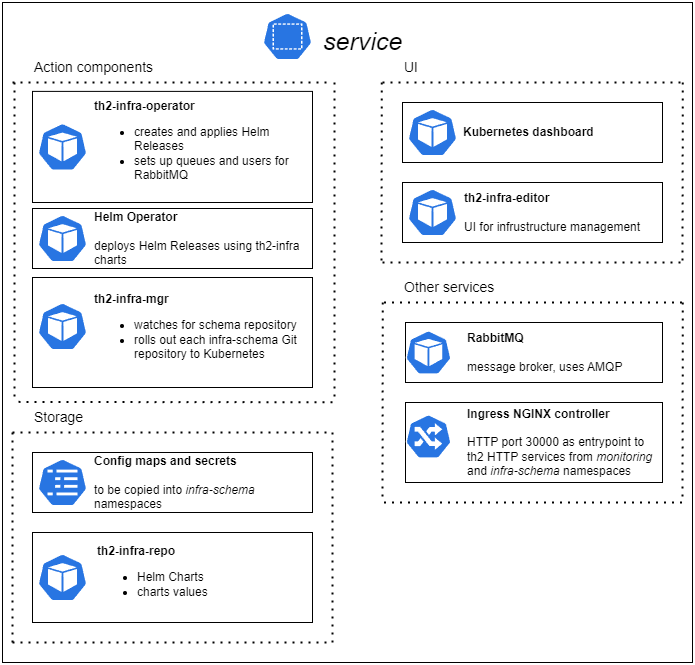
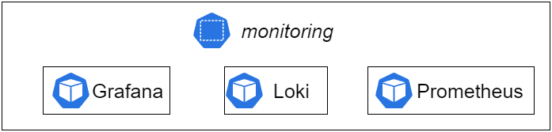
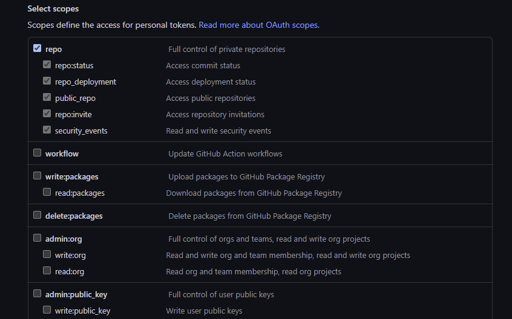

# 3. Deploy th2

As all the environments are prepared, we can install th2.

<!--more-->

## Prerequisites
Before you begin, please check that you have:
* fully functioning Kubernetes cluster suitable for your business needs (please refer to [technical requirements](../requirements));
* an operator box that meets [hardware](../requirements/hardware) and [software](../requirements/software) requirements;
* installed [Apache Cassandra](https://cassandra.apache.org/) ([technical requirements](../requirements/hardware#apache-cassandra-cluster-hardware-requirements)).
  
All th2 components are deployed via Helm charts by [Helm](https://helm.sh/) and [Helm Operator](https://docs.fluxcd.io/projects/helm-operator/en/stable/).


## Download infra values
Installation of th2-infra requires a Git repository for maintaining th2 infra-schema configuration. The information regarding this repository and its usage can be found in the guide further.
* [These example values](https://github.com/th2-net/th2-infra/tree/master/example-values) can be used as a starter kit for th2 infra, we also recommend storing these values in a separate Git repository.

The first step of the th2 deployment process is copying th2-infra repository into your operator box:

```shell
git clone -b v1.7.3 https://github.com/th2-net/th2-infra.git
```

Change the current directory:

```shell
cd ./th2-infra/example-values
```


## Infrastructure namespaces

Inside the cluster separate namespaces can be created. Custom infra-schemas can have their namespaces.

<notice info>

The "infra-schema" part in the *infra-schema* namespace is a placeholder to be replaced with a user-defined name of a custom infra-schema (corresponds to the name of the repository branch containing a particular infra-schema implementation).

</notice>

Infrastructure components are split into two namespaces: _monitoring_ and _service_. These namespaces will be created below.

The following components of monitoring stack are deployed into _monitoring_ namespace:

<recommendations :items="$frontmatter.monitoring_links"></recommendations>

The _service_ namespace is used for infrastructure services:

<recommendations :items="$frontmatter.service_links"></recommendations>
  
and for th2-infra components:

<recommendations :items="$frontmatter.infra_links"></recommendations>

### Create namespaces

```shell
kubectl create namespace monitoring
kubectl create namespace service
```

<spoiler title="Output example">

```shell
$ kubectl create namespace monitoring
namespace/monitoring created
$ kubectl create namespace service
namespace/service created
```

</spoiler>  

The following pictures describe *service* and *monitoring* namespaces:






## Data persistence

Data persistence is required for the following components: Grafana, Prometheus, Loki, RabbitMQ and should be set up on this step.

<notice info>

Examples below use HostPath type of [Persistent Volume(PV)](https://kubernetes.io/docs/concepts/storage/persistent-volumes/). 
Please read the documentation to choose an appropriate PV type for your environment.

</notice>

* Create directories on the th2 node (the following command can require root permissions):

```shell
mkdir /opt/grafana /opt/prometheus /opt/loki /opt/rabbitmq
```

* Set node name in `pvs.yaml`.
* Create PVs and PVCs:
```shell
kubectl apply -f ./pvs.yaml
kubectl apply -f ./pvcs.yaml
```

### PV for read components

To include **read** components in your configuration, a dedicated PersistentVolume for **read** log directory needs to be set up.
Add a PersistentVolume mapped to the `/opt/components` directory.  Once an *infra-schema* namespace is installed, create a PersistentVolumeClaim. 

PV and PVC examples can be found in `example-values/persistence/`.

```shell
mkdir /opt/components
```
* Set node name in `persistence/pv.yaml`.
* Create PV:
```shell
kubectl apply -f ./persistence/pv.yaml
```

## Monitoring deployment

<notice note> 

It's an optional step, but it provides an easier way to check the result of the installation. 
In all installation commands we explicitly define namespaces to avoid possible mistakes.

</notice>

* Switch the namespace to _monitoring_:
```shell
kubectl config set-context --current --namespace=monitoring
```

<notice note>

Grafana and Dashboard hostnames should be configured only if you have a DNS name. IP address configuration is not required. 

</notice>

* Define Grafana and Dashboard hostnames (the name must be resolved from the tester boxes):
  * in the [service.values.yaml](https://github.com/th2-net/th2-infra/blob/v1.7.3/example-values/service.values.yaml) file:
    ```yaml
    ingress:
      host: &host <th2_host_name>
    kubernetes-dashboard:
      ingress:
        hosts: [*host]
    ```
  * in the [prometheus-operator.values.yaml](https://github.com/th2-net/th2-infra/blob/v1.7.3/example-values/prometheus-operator.values.yaml) file:
    ```yaml
    grafana:
      ingress:
        hosts:
          - <th2_host_name>
    ```

* Deploy components:
```shell
helm repo add grafana https://grafana.github.io/helm-charts
helm repo add prometheus-community https://prometheus-community.github.io/helm-charts
helm install --version=2.4.1 loki -n monitoring grafana/loki-stack -f ./loki.values.yaml
helm install --version=15.0.0 prometheus -n monitoring prometheus-community/kube-prometheus-stack -f ./prometheus-operator.values.yaml
```
* Check the result:
```shell
$ kubectl get pods
NAME                                                     READY   STATUS    RESTARTS   AGE
........
alertmanager-prometheus-prometheus-oper-alertmanager-0   2/2     Running   0          75s
loki-0                                                   1/1     Running   0          4m47s
loki-promtail-wqfml                                      1/1     Running   0          4m47s
prometheus-grafana-68f8dd6d57-2gtns                      2/2     Running   0          82s
prometheus-kube-state-metrics-75d4cc9dbd-psb88           1/1     Running   0          82s
prometheus-prometheus-node-exporter-gfzp6                1/1     Running   0          82s
prometheus-prometheus-oper-operator-df668d457-snxks      1/1     Running   0          82s
prometheus-prometheus-prometheus-oper-prometheus-0       3/3     Running   1          65s        
........
```

## Access for infra-mgr to the th2 infra-schema Git repository

### SSH key

SSH access with write permissions is required by **infra-mgr** component.

* Generate keys without a passphrase:  
```
$ ssh-keygen -t rsa -m pem -f ./infra-mgr-rsa.key
``` 
* [Add a new deploy key to your infra-schema repository on GitHub ](https://docs.github.com/en/developers/overview/managing-deploy-keys#deploy-keys).
* Create infra-mgr secret from the private key:
```
$ kubectl -n service create secret generic infra-mgr --from-file=id_rsa=./infra-mgr-rsa.key
```

* set `infraMgr.git.repository` value in the [service.values.yaml](https://github.com/th2-net/th2-infra/blob/v1.7.3/example-values/service.values.yaml) file to `ssh` link of your infra-schema repository, e.g:
```yaml
infraMgr:
  git:
    repository: git@github.com:th2-net/th2-infra-demo-configuration.git
```

### Personal access token

Due to the [improvements in Git protocol security](https://github.blog/2021-09-01-improving-git-protocol-security-github/) on GitHub, keys supported in ssh have underwent changes. 
These changes affected the th2 ssh connections to the GitHub repositories. 
SSH keys generated with RSA algorithm are no longer accepted when uploaded to GitHub after March 15, 2022. 
However, the keys uploaded before this date continue to work.

GitHub repositories can be accessed via personal access tokens. 
In case you cannot use a token, update your th2 version to use ssh connection.

<recommendations :items="$frontmatter.tokens_link" ></recommendations>

It is required to grant permissions from `repo` scope. 
Other permissions are not needed.



Set `infraMgr.git.repository` value in the [service.values.yaml](https://github.com/th2-net/th2-infra/blob/v1.7.3/example-values/service.values.yaml) file to **https** link of your infra-schema repository. 
Generate and include PAT as HTTP auth credentials.

```yaml
infraMgr:
  git:
    repository: https://github.com/th2-net/th2-infra-demo-configuration.git
    httpAuthUsername: "<token>" 
    httpAuthPassword: "<token>" 
```

infra-mgr secret is still required.

```shell
kubectl -n service create secret generic infra-mgr --from-literal=infra-mgr=infra-mgr
```

### Using Git server internally in Kubernetes


If you have any restrictions to get access to any external repositories from the k8s cluster, Git service can be deployed according to the following instruction:

*  Create PersistentVolume "repos-volume", example is presented in the `./example-values/persistence/pv.yaml`;
*  Create configmap "keys-repo" from public part of key from point [Access for infra-mgr to the th2 infra-schema Git repository](#access-for-infra-mgr-to-the-th2-infra-schema-git-repository):

```shell
kubectl -n service create configmap keys-repo --from-file=authorized_keys=./infra-mgr-rsa.pub
```
*  Define configs for infra-git in `services.values.yaml`. 
*  Set `infraMgr.git.repository` value in the `service.values.yaml` file to **ssh** link of your repository, e.g:
```yaml
infraMgr:
  git:
    repository: ssh://git@git-ssh/home/git/repo/<your_repo_name>.git
```
* After installation, you should initiate a new repository with the name defined at the previous step.


## Cluster configuration

Once all the required software is installed on your th2 node, Apache Cassandra node, and operator box, and th2-infra repository is ready, you can start configuring the cluster.

* Switch namespace to *service*:
```
$ kubectl config set-context --current --namespace=service
```

### Define Cassandra hostname
* Set `cassandra.host` value for `cassandra` in the [service.values.yaml](https://github.com/th2-net/th2-infra/blob/v1.7.3/example-values/service.values.yaml) file. 
* It is also recommended specifying a name of Cassandra datacenter (it is `datacenter1` by default):

```yaml
cassandra:
  internal: false
  host: <cassandra-host>
  cluster: 
    datacenter: datacenter1
```

### Define RabbitMQ Ingress parameters
If required, add the `rabbitmq.ingress.hostName` value into [service.values.yaml](https://github.com/th2-net/th2-infra/blob/v1.7.3/example-values/service.values.yaml) file. Otherwise, the RabbitMQ HTTP service will be available on the node IP address.

### Define th2 Ingress parameters
If required, add `ingress.hostname` value into [service.values.yaml](https://github.com/th2-net/th2-infra/blob/v1.7.3/example-values/service.values.yaml) file. Otherwise, th2 HTTP services will be available on the node IP address.


```yaml
ingress:
  host: example.com
```

In order to include Kubernetes address to configurations for external interactions, you can add option `infraOperator.config.k8sUrl`, which can be both an IP address or a domain name.

```yaml
infraOperator:
  config:
    k8sUrl: "<kubernetes-external-entrypoint>"
```

### Create secret with th2 credentials

Create `secrets.yaml` in `./` folder (*do not commit into Git*). Example:
```yaml
# required only for images from a private registry, will be attached as the first PullSecret to deployments
#productRegistry:
#  username: user
#  password: password
#  name: private-registry-1.example.com # core components registry
# required only for images from a private registry, will be attached as the second PullSecret to deployments
#solutionRegistry:
#  username: user
#  password: password
#  name: private-registry-2.example.com # components registry
# required only for images from a private registry, will be attached as the third PullSecret to deployments
#proprietaryRegistry:
#  username: user
#  password: password
#  name: private-registry-3.example.com # components registry
cassandra:
# set credentials for existing Cassandra cluster
  dbUser:
    user: <user-name>
    password: <password>
rabbitmq:
# set admin user credentials, it will be created during deployment
  rabbitmqUsername: th2
  rabbitmqPassword: rab-pass
  # must be a random string
  rabbitmqErlangCookie: cookie
```

## th2 deployment
### Install NGINX Ingress Controller
```shell
helm repo add ingress-nginx https://kubernetes.github.io/ingress-nginx
helm install -n service --version=3.31.0 ingress ingress-nginx/ingress-nginx -f ./ingress.values.yaml
```
Check:
```shell
$ kubectl get pods
NAME                                                READY   STATUS    RESTARTS   AGE
........
ingress-ingress-nginx-controller-7979dcdd85-mw42w   1/1     Running   0          30s
........
```

### Install th2-infra components in the service namespace
```shell
helm repo add th2 https://th2-net.github.io
helm install -n service --version=<version> th2-infra th2/th2 -f ./service.values.yaml -f ./secrets.yaml
```

<notice note>

Replace `<version>` with th2-infra release version you need. You can check versions [here](https://github.com/th2-net/th2-infra/releases)

</notice>

Wait for all the pods in *service* namespace to be up and running. Once completed, proceed with [infra-schema configuration](https://github.com/th2-net/th2-infra-schema-demo/blob/master/README.md) to deploy th2 namespaces.


## th2 infra links:
- Kubernetes dashboard `http://your-host:30000/dashboard/`
- Grafana `http://your-host:30000/grafana/`
- th2-infra-editor `http://your-host:30000/editor/`
- RabbitMQ `http://your-host:30000/rabbitmq/`
- th2-reports `http://your-host:30000/your-namespace/`
