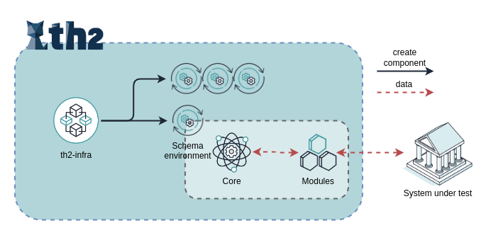

# Infrastructure

The infrastructure of th2 consists of elements collectively referred to as Infra components. 
One of the components is the infra-schema describing a test environment consisting of th2 <term term='core'>Core</term> and <term term='module'>Module</term> boxes. 
The rest of the infra components work together to monitor and maintain this test environment in a state desired by the user.
Additionally, infra components allow users to change or update deployed test environments.

<!--more-->

Learn more about th2 infrastructure:
- [th2-infra](./infrastructure/th2-infra-repository)
- [th2-infra-schema](./infrastructure/th2-infra-schema)
- [th2-infra components](./infrastructure/infra-components)

