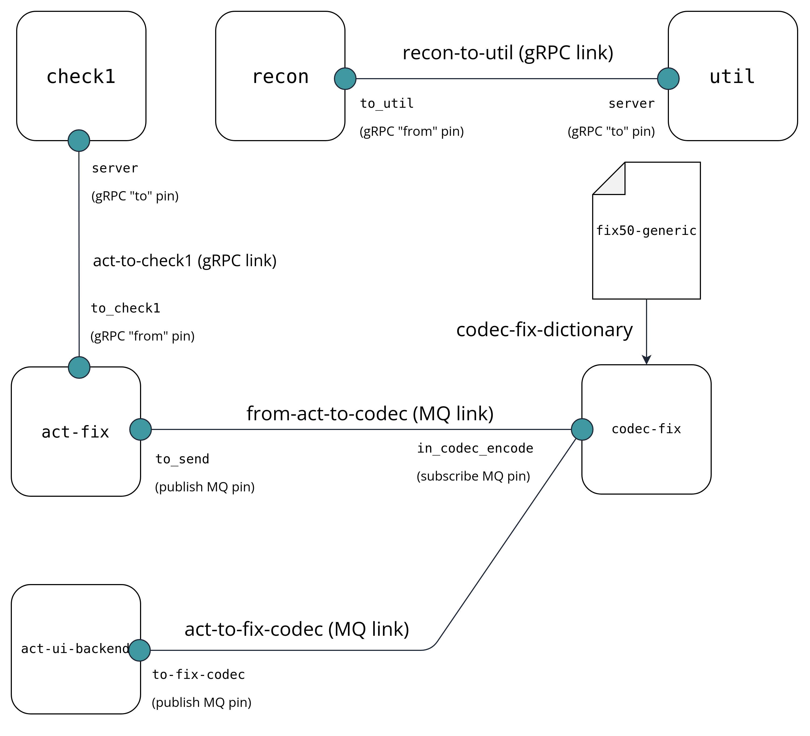

# Links

After all the pins are defined and configured, you should also specify the links between them. 
It can be done by uploading a special CR called the th2 link. 
Based on the components that the links connect, they can be separated into several files (e.g. `from-codec-links.yaml`, `from-act-links.yaml`, `dictionary-links.yaml`). 
The most important is the location of the `.yaml` files in the links directory. 
Also, all links can be configured in one file, but links for the dictionary should be in the `dictionaries-relation` section, and all other links in the `boxes-relation` section.

Links from the `boxes-relation` section connect boxes (Kubernetes pods) using pins, whereas, the  `dictionaries-relation` links allow boxes to use dictionary files (that are not related to the Kubernetes pods). 

## Dictionary links

Example of `dictionary-links`: 
```yaml
apiVersion: th2.exactpro.com/v1
kind: Th2Link
metadata:
  name: dictionary-links
spec:
  dictionaries-relation:
    - name: codec-fix-dictionary
      box: codec-fix
      dictionary:
        name: fix50-generic
        type: MAIN
```

## Boxes links

Each link has the following attributes:

- `name` - the name of the link;

- `from` - the pin of the box from which this link goes;

- `to` - the pin of the box to which it leads.

There are two ways of communication between the components via links:

- RabbitMQ - message broker for asynchronous messaging;

- gRPC - for specifying routing calls.

For each of the connection type there is a separate option in configuration:

- `router-mq`

- `router-grpc`  

Example of `boxes-links`: 

```yaml
apiVersion: th2.exactpro.com/v1
kind: Th2Link
metadata:
  name: set-of-links
spec:
  boxes-relation:
    router-mq:
      - name: mq_relation_link
        from:
          box: source_box_name
          pin: publish_pin_name
        to:
          box: destination_box_name
          pin: subscribe_pin_name
    router-grpc:
      - name: grpc_relation_link
        from:
          box: source_box_name
          pin: source_pin_name
        to:
          box: destination_box_name
          pin: destination_pin_name
```
### MQ Router

MQ links are described in the `router-mq` section of the link `.yaml` file. When using MQ links, you should keep in mind that the pins that are marked with the `publish` attribute must be specified in the `from` section, and those marked with `subscribe` (or not marked with either) must be specified in the `to` section. The message flow between the pins should be from `publish` to `subscribe`. 

```yaml
apiVersion: th2.exactpro.com/v1
kind: Th2Link
metadata:
  name: from-conn-links
spec:
  boxes-relation:
    router-mq:
      - name: democonn1-codec
        from:
          box: demo-conn1
          pin: in_raw
        to:
          box: codec-fix
          pin: in_codec_decode
```

### gRPC Router

gRPC links are described in the section `router-grpc`.

<notice note> Starting from v.1.7 of th2-infra-schema, this section no longer contains the `strategy` and `service-class` fields. 
For newer releases, the properties are to be specified in configurations of pins ([more details](./pins#service-classes-setting-for-grpc-connection-type)). </notice>


An example of a gRPC link:

```yaml
apiVersion: th2.exactpro.com/v1
kind: Th2Link
metadata:
  name: from-act-links
spec:
  boxes-relation:
    router-grpc:
      - name: act-to-check1
        from:
          box: act-fix
          pin: to_check1
        to:
          box: check1
          pin: server
```
## Example

Here you can see shortened example of [links.yaml](https://github.com/th2-net/th2-infra-schema-demo/blob/ver-1.5.4-main_scenario/links/links.yml) file with different sections:
```yaml
apiVersion: th2.exactpro.com/v1
kind: Th2Link
metadata:
  name: links
spec:
##############################################################################
###                           DICTIONARIES                                 ###
##############################################################################
  dictionaries-relation:
    - name: codec-fix-dictionary
      box: codec-fix
      dictionary:
        name: fix50-generic
        type: MAIN
##############################################################################
    - name: codec-fix-demo-dictionary
      box: codec-fix-demo
      dictionary:
        name: fix50-generic
        type: MAIN

##############################################################################
###                           BOXES MQ                                     ###
##############################################################################
  boxes-relation:
    router-mq:
#########################ACT-FIX -> CODEC-FIX#################################
      - name: from-act-to-codec
        from:
          box: act-fix
          pin: to_send
        to:
          box: codec-fix
          pin: in_codec_encode
##############################################################################
#####################ACT-UI-BACKEND -> CODEC-FIX##############################
      - name: act-to-fix-codec
        from:
          box: act-ui-backend
          pin: to-fix-codec
        to:
          box: codec-fix
          pin: in_codec_encode

##############################################################################
###                         BOXES GRPC                                     ###
##############################################################################
    router-grpc:
#####################ACT-FIX -> CHECK1########################################
      - name: act-to-check1
        from:
          box: act-fix
          pin: to_check1
        to:
          box: check1
          pin: server
##############################################################################
#####################RECON -> UTIL############################################
      - name: recon-to-util
        from:
          box: recon
          pin: to_util
        to:
          box: util
          pin: server
```
Below is the illustration of links between boxes given in the configuration file above.
 
