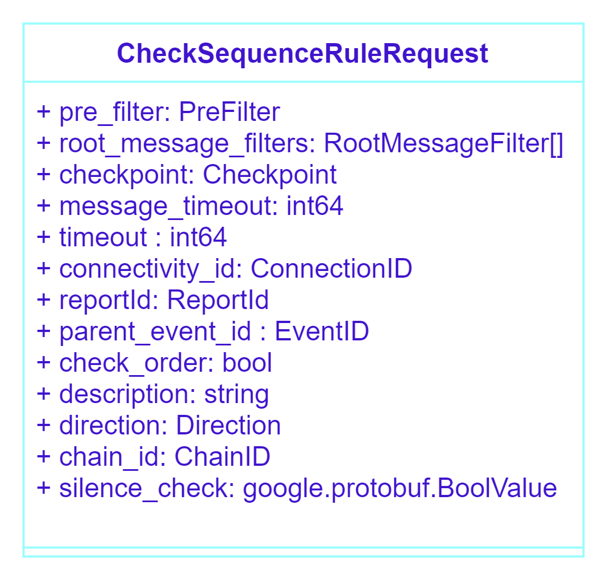
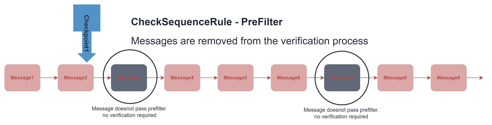
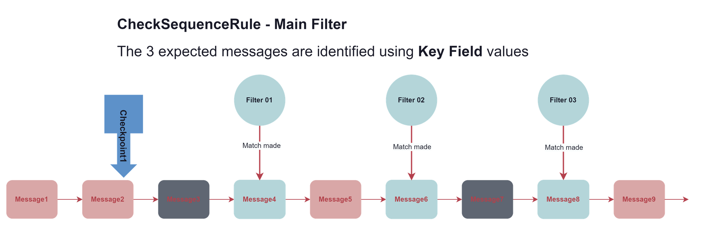
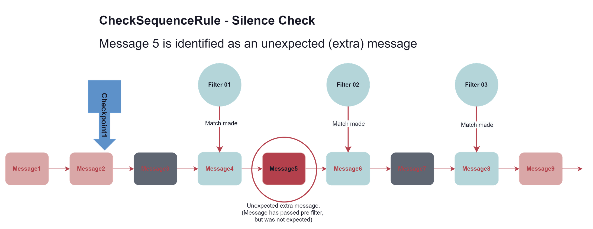
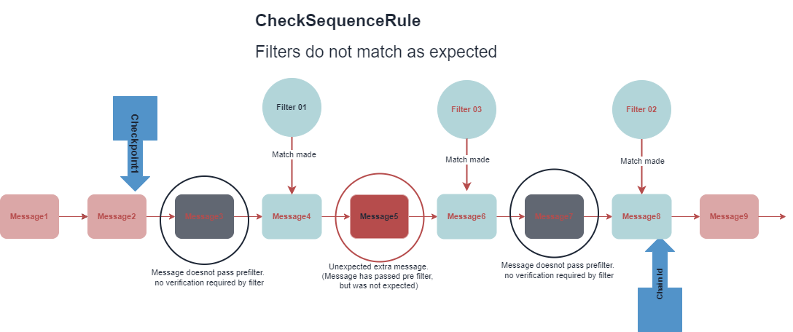
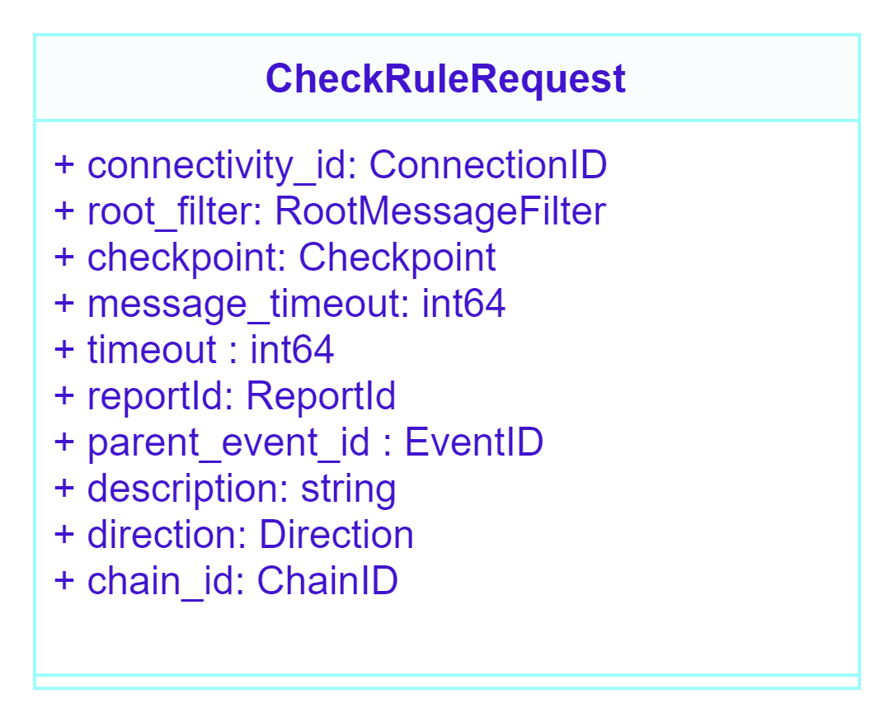
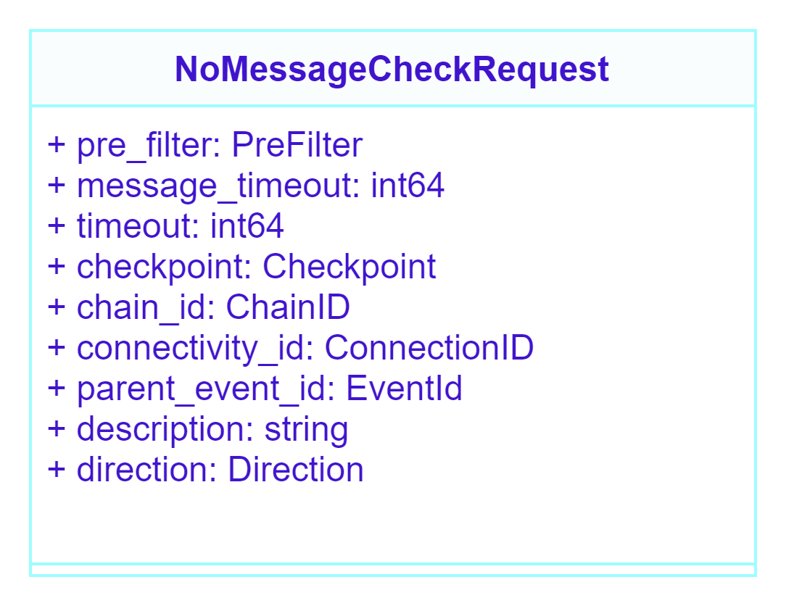

# Verification by a single rule request

##  Verification using `CheckSequenceRuleRequest`

 
<figcaption class="mb-2">
Figure1. Verification of message queue by **check1** using `CheckSequenceRuleRequest`.
</figcaption>

## Structure of the `CheckSequenceRuleRequest`

 
<figcaption class="mb-2">
Figure 2. Class Diagram of `CheckSequenceRuleRequest`
</figcaption>

`CheckSequenceRuleRequest` is the recommended rule request since it comes with additional capabilities that overlap the functional capabilities of the other two rule requests.

### The PreFilter Class
`CheckSequenceRuleRequest` comes with a pre-filter. 
A pre-filter is a mechanism for filtering messages that are not of interest to the user, for example - Heartbeats in FIX. 
The pre-filter allows checking of only those messages that have passed through it. 
Therefore, users must be careful to not accidentally filter out potentially necessary messages.

 
<figcaption class="mb-2">
Figure 3. Messages (in black) are not considered for verification due to PreFilter. 
</figcaption>

### Identifying system responses
After pre-filtering, the messages in the queue have to be matched with the main filters (class `RootMessageFilters[]` ) to identify the expected messages. 
The expected responses are identified via the key fields found in the main filter. 
`key_fields` is a list of fields that will be used as keys when determining whether the expected message has been received or not.

Each filter contains a key field which matches with a single expected message. `CLOrdid` (client order id) is used as the key field and **check1** matches the filter-message pair according to the value.

 
<figcaption class="mb-2">
Figure 4. The three filters matching up with three responses (turquois color)
</figcaption>

### Locating unexpected messages
If a message passed pre-filter, but is not in the expected, it is considered as an extra message. 
The extra messages are located by setting the `silence_check` parameter to `True` or by the `auto-silence-check-after-sequence-rule` in the **check1** custom configuration.

 
<figcaption class="mb-2">
Figure 5. An extra message is identified by silence check
</figcaption>

### Completion of Verification
You can allocate the amount of time for rule execution using the rule parameter timeout .

If timeout is not specified in the rule request, the default value is **check1**’s rule-execution-timeout property.

The rule execution stops automatically after the allocated time passes. 
The time unit is measured milliseconds.

### Unmatched Filters
If any or none of the filters match up with the message(s) in the queue within the allocated time the user is notified about the mismatch between the number of received and expected system messages.

### Verification of message order
The filters in `CheckSequenceRuleRequest` are an ordered list and the order received should match with the filter order.

To check order, the `CheckSequenceRuleRequest` parameter `check_order` is set to `True`.

 
<figcaption class="mb-2">
Figure 6. Filter order (expected order) does not match the message order received (actual).
</figcaption>

### Field validation
Once the expected messages are located, field validation is conducted by comparing the expected values to the actual values of the parameters. 
The user is notified of any inaccuracies.

### Returning a Chain ID
Once verification is complete **check1** returns a chain id value which can be used for chain verification

## Using CheckRuleRequest for  verification

 
<figcaption class="mb-2">
Figure 7. Structure of the CheckRuleRequest.
</figcaption>

The `CheckRuleRequest` function is similar to the `CheckSequenceRuleRequest` but is used to locate a single message in the message queue. 
Since the `CheckRuleResponse` returns a value for chain_id you could use this rule to continue verification. 

### Using NoMessageRuleRequest
This rule request is used to check for extra messages, and comes with a PreFilter class. 

 
<figcaption class="mb-2">
Figure 8. Structure of NoMessageCheckRequest.
</figcaption>

