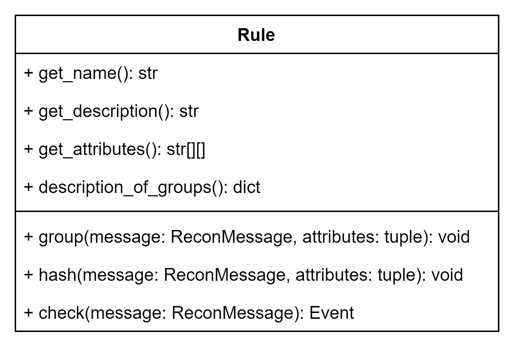
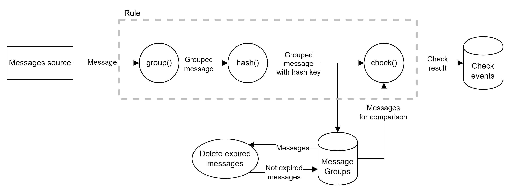
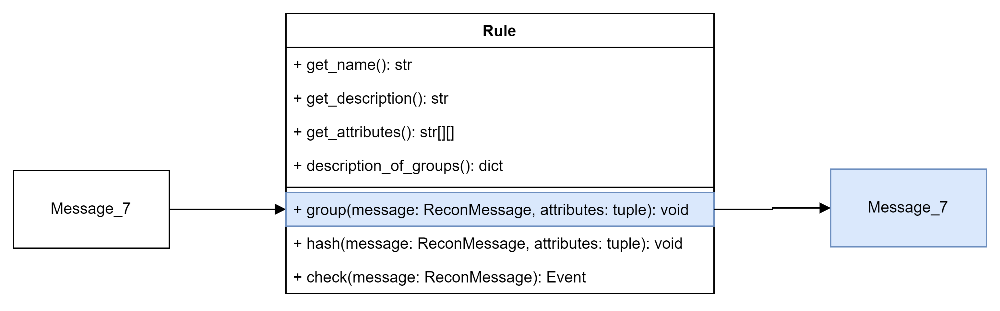
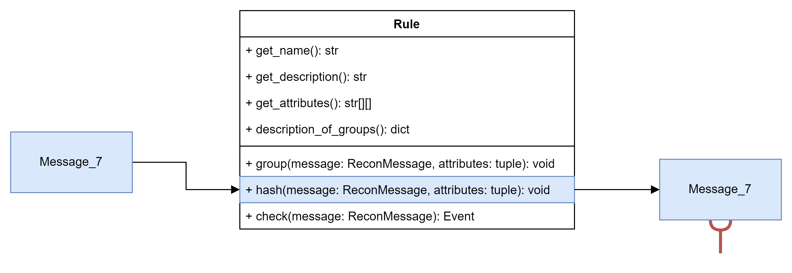
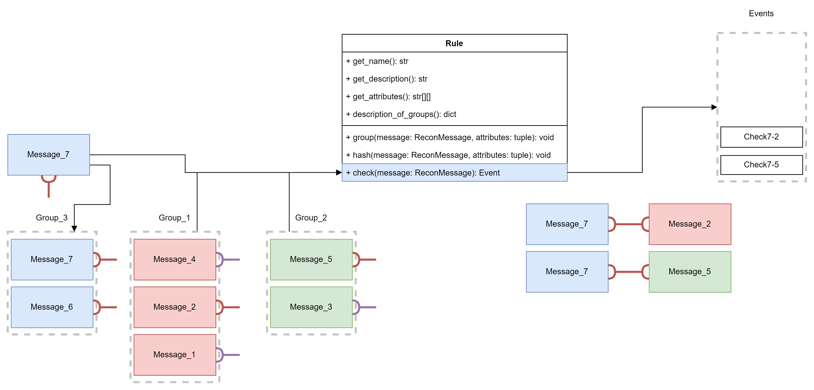

# Usage

In files containing the rule class Rule should be defined. Structure of class Rule is as follows.



Getters:

- `get_name()` - name of the rule;
- `get_description()` - description of the rule;
- `get_attributes()` - required message stream attributes;
- `desciption_of_groups()` - dictionary containing names of the groups and its type.

Group types are available in a **check2-recon** package. At the moment there are 2 group types:

- Type `single` means that all messages in the group have unique hashes (key of the message) - a new message replaces old.
- Type `multiple` means that several messages with the same hash can be stored in one message group.

Examples of getters:

```python
##### rule_demo.py #####
def get_name(self) -> str:
       return "Rule_demo"
       
def get_description(self) -> str:
       return "Rule_demo is used for demo"
       
def get_attributes(self) -> [list]:
       return [
           ['parsed', 'subscribe']
       ]
       
 def description_of_groups(self) -> dict:
       return {'ExecutionReport': MessageGroupType.multi,
               'NewOrderSingle': MessageGroupType.single}
```

Methods `group()`, `hash()`, `check()`  in class Rule are responsible for messages processing.
Every incoming single message comes to the `group` method, then `hash` method, then `check` method.

The lifecycle of an incoming message is:

1. Comes in rule from some kind of pin. A record about this is written to log.
2. The `group(message, attributes)` method is called for this message. It is calculated in which message group the message should be placed.
3. The hash of the message is calculated using the `hash(message, attributes)`.
4. Searches for messages with the same hash in other message groups.
5. If a message with the same hash is found in each group, `check(messages)` is called for all these messages. Depending on the types of message groups and their number, it will be determined which messages to delete and which to keep.
6. If no similar messages are found, then just add the message to the group.



## group()

Method `group()` analyses message with an algorithm written by a user and
sets the message's group id. Further, it will help to reveal the group the
message belongs to. Let us say, it means that we put a message to the group
with `group` method.



Implementation example:

```python
##### rule_demo.py #####
def group(self, message: ReconMessage, attributes: tuple):
       message_type: str = message.proto_message.metadata.message_type
       if message_type not in ['ExecutionReport', 'NewOrderSingle']:
           return
       message.group_id = message_type
       message.group_info['message_type'] = message_type
```

## hash()

Method `hash()` generates the hash key for the message to join it in the future.
Hash key depends on one or several fields of the message.
The fields are defined by a user in `method` implementation.
If all these fields are the same in 2 messages, final hash keys also will be equal.



Implementation example:

```python
##### rule_demo.py #####
def hash(self, message: ReconMessage, attributes: tuple):
       cl_ord_id = message.proto_message.fields['ClOrdID'].simple_value
       message.hash = hash(message.proto_message.fields['ClOrdID'].simple_value)
       message.hash_info['ClOrdID'] = cl_ord_id
```

## check()

Method `check()` compares the message with all messages from different groups and equal hash key.
After the comparison `check` method generates an event with its result.
Filling of the final event is defined by the algorithm written by a user.
After that original message is available for comparison with future messages until timeout (message's Time To Live).



Implementation example:

```python
##### rule_demo.py #####
def check(self, messages: [ReconMessage]) -> Event:
       settings = ComparisonSettings()
       compare_result = self.message_comparator.compare(messages[0].proto_message, messages[1].proto_message, settings)
       verification_component = VerificationComponent(compare_result.comparison_result)

       info_for_name = dict()
       for message in messages:
           info_for_name.update(message.hash_info)

       body = EventUtils.create_event_body(verification_component)
       attach_ids = [msg.proto_message.metadata.id for msg in messages]
       return EventUtils.create_event(name=f"Match by '{ReconMessage.get_info(info_for_name)}'",
                                      attached_message_ids=attach_ids,
                                      attached_message_ids=attach_ids,
                                      body=body)
```
