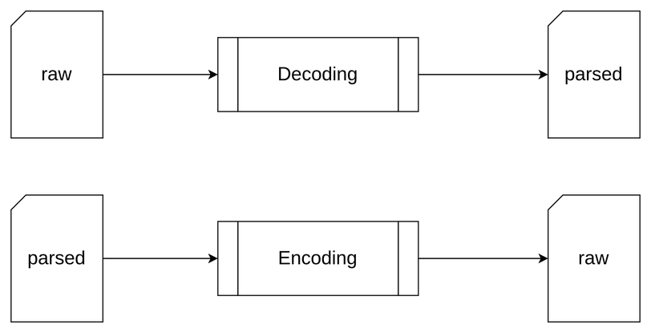
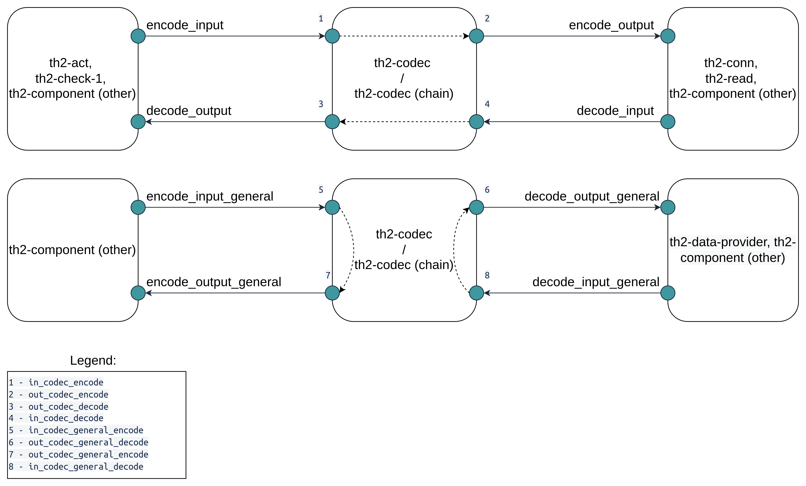

# Overview 

The **codec** is a component responsible for transforming <term term='message'>messages</term> from human-readable format into a format of a corresponding protocol and vice versa. 
It contains the main logic for encoding and decoding messages. 
The **codec** usually uses <term term='dictionary'>dictionary</term> to decode and encode messages. 
Dictionaries contain message structures, fields and values that **codec** can decode. 

## Encoding
During encoding, **codec** replaces each parsed message of the supported protocols in a message group with a raw one, by encoding parsed message content.

NOTE: **codec** can merge content of subsequent raw messages into a resulting raw message (e.g. when a **codec** encodes only a transport layer and its payload is already encoded).


## Decoding
During decoding **codec** must replace each raw message in a message group with a parsed one by decoding raw message content. 
If an exception was thrown, all raw messages will be replaced with `th2-codec-error` parsed messages.

NOTE: **codec** can replace a raw message with a parsed message followed by several raw messages (e.g. when a **codec** decodes only a transport layer it can produce a parsed message for the transport layer and several raw messages for its payload).

The schema below describes encoding/decoding processes. 



- `raw` - <term term='pin'>pin</term> configuration item, message passing through this pin for processing is in a machine-readable format, ready to be sent or received via according protocol or being decoded.

- `parsed` - pin configuration item, message passing through this pin for processing is in a human-readable format, used in th2.

- `encode` - pin configuration item, message passing through this pin will be translated from parsed to raw.

- `decode` - pin configuration item, message passing through this pin will be translated from raw to parsed.


Example of a raw message (FIX protocol):
```
8=FIXT.1.19=6835=034=159049=fix-client156=fix-server152=20220608-13:14:37.58110=043
```

Example of a parsed message (FIX protocol):

```json
{
  "metadata": {
    "id": {
      "connectionId": {
        "sessionAlias": "fix-server1"
      },
      "sequence": "1653493560372614018",
      "subsequence": [
        1
      ]
    },
    "timestamp": "2022-06-08T13:14:37.582Z",
    "messageType": "Heartbeat",
    "protocol": "FIX"
  },
  "fields": {
    "trailer": {
      "messageValue": {
        "fields": {
          "CheckSum": {
            "simpleValue": "043"
          }
        }
      }
    },
    "header": {
      "messageValue": {
        "fields": {
          "BeginString": {
            "simpleValue": "FIXT.1.1"
          },
          "SenderCompID": {
            "simpleValue": "fix-client1"
          },
          "SendingTime": {
            "simpleValue": "2022-06-08T13:14:37.581"
          },
          "TargetCompID": {
            "simpleValue": "fix-server1"
          },
          "MsgType": {
            "simpleValue": "0"
          },
          "MsgSeqNum": {
            "simpleValue": "1590"
          },
          "BodyLength": {
            "simpleValue": "68"
          }
        }
      }
    }
  }
}
```

## Functions

The **codec** component handles message flows between components such as **conn**, **act**, **check1**, **read** and other. 
On the scheme below you can see an example of interaction with other th2 components.



The **codec** component has eight pins - four for the stream, and four general ones. 
Functionality of the stream and the general pins is the same. 
A common system setup uses two data flows: 1) to and from the system, and 2) to and from data provider. 
Messages from these flows cannot be mixed. 
One way to avoid this intersection is to use two instances of a component with four pins. 
Another option is to configure eight pins – this allows the user to decrease the amount of required settings in **infra-schema** as well as resource utilization of the resulting system. 
General pins are used by the data-provider component, other components are usually connected to the stream pins.

### Why do we need a chain of codecs?

It is a very common case when the messages you send or receive from the system have the following structure: a transport layer protocol and a payload wrapped into the transport layer. 
The payload can be any other protocol (even another transport protocol and a different payload wrapped into it). 
Also, sometimes different systems use the same transport protocol but with the different payload wrapped into it (e.g. HTTP + JSON, HTTP + FIX).

In case you need to encode/decode a message but do not have a single **codec** for such case, you can reuse already implemented **codecs** by joining them into a chain of **codecs**. It is also recommended for the **codec** to work only with a single protocol.  
For example, you have HTTP, JSON and XML **codec**. 
You can join them together for decoding XML over HTTP or JSON over HTTP.

If the **codec** component gets a message that does not match an expected format (a raw message of corresponding protocol to `in_codec_decode` pin and a parsed message to `in_codec_encode` pin) it will be sent through the corresponding out pins without changes.
