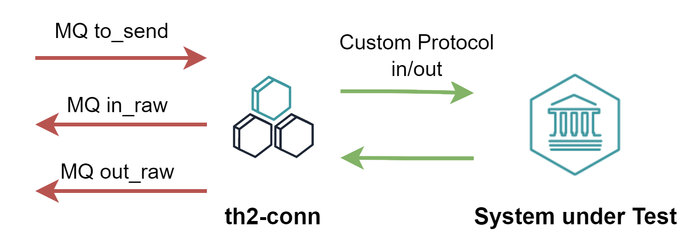

# Overview

**conn** ("conn" stands for "connect") component is responsible for the communication with a target system. 
This component implements the logic of the interaction protocol, receiving and sending messages from and to the system, respectively.

<!--more-->

