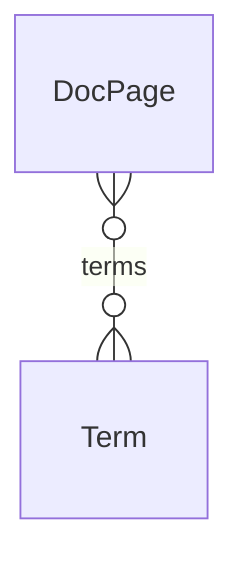

# Terms plugin

This plugin creates collection of terms parsed from `content/terms` and links terms with pages when they are used.

## Created structure

```mermaid
erDiagram
    DocPage }o--o{ Term : terms
```