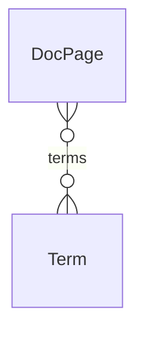

# Terms plugin

This plugin creates a collection of terms parsed from `content/terms` and, whenever the terms are used, links them to pages.

## Created structure

```mermaid
erDiagram
    DocPage }o--o{ Term : terms
```
