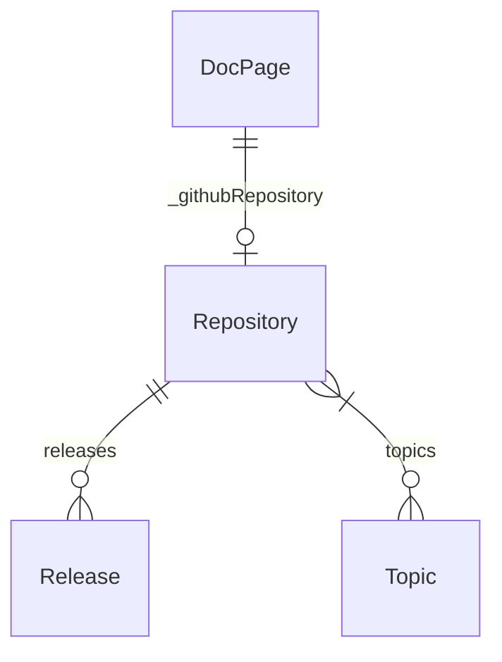

# th2 GitHub source plugin

This plugin parses information about public [th2-net](https//github.com/th2-net) repositories with `octokit`. All information is saved in the database. 

If needed, Documentation pages are linked to GitHub repositories.

## Requirements

This plugin requires the GitHub Personal Access Token (PAT) as a `GITHUB_TOKEN` environment variable.

It is an option to pass the PAT into `.env`:

```
GITHUB_TOKEN=my_token
```

## Created structure

> The types are available in the [GraphQL schema](../../../../schema.graphql):


