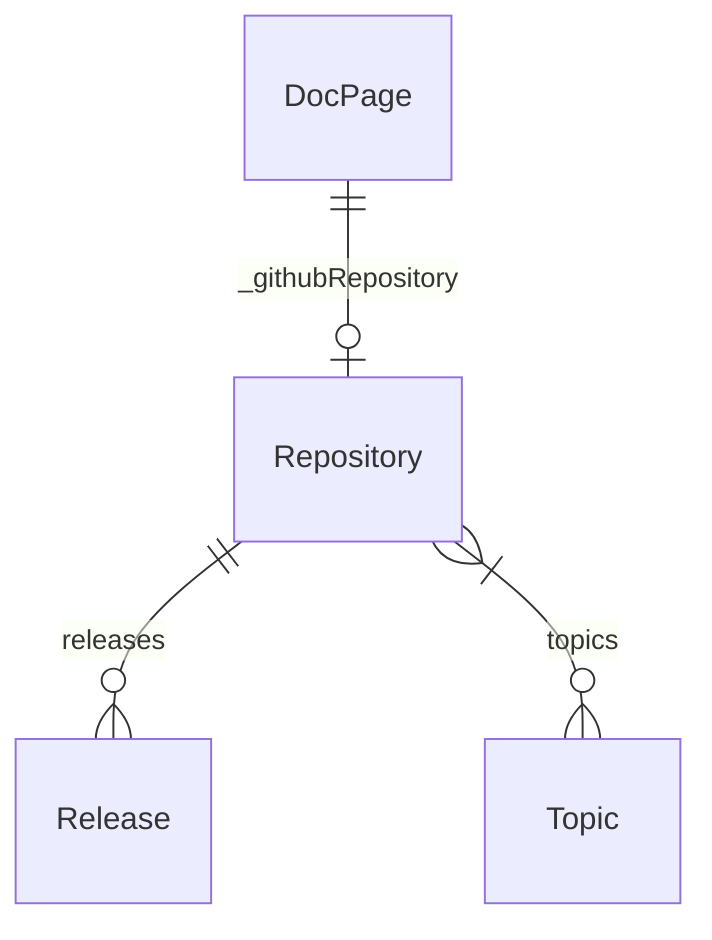

# th2 GitHub source plugin

This plugin parses information about public [th2-net](https//github.com/th2-net) repositories with `octokit`. All information is saved in database. 

If it is needed Documentation pages are linked to GitHub repositories.

## Requirements

This plugin requires GitHub Personal Access Token as `GITHUB_TOKEN` environment variable.

It is an option to past PAT into `.env`

```
GITHUB_TOKEN=my_token
```

## Created structure

> Types are available in [graphql schema](../../../../schema.graphql)


